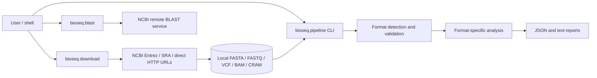
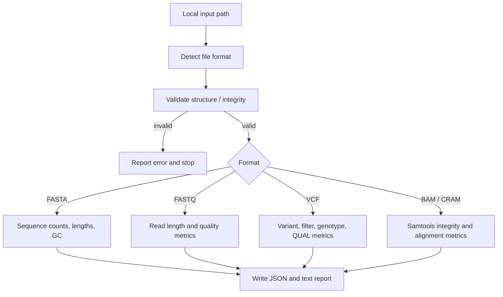
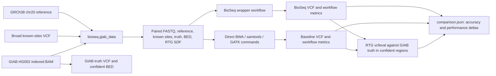

# BioSeq Architecture

BioSeq is a bioinformatics project with three deliberately separate execution
paths:

1. A lightweight CLI that validates and summarizes one input file.
2. An opt-in HG002 benchmark that prepares a known sample, aligns reads, calls
   small variants, and measures calls/performance against a direct-tool
   baseline and GIAB truth.
3. Nextflow workflows for the staged HG002 variant benchmark and a raw-read
   paired-donor RNA-seq differential-expression analysis in R/DESeq2.

The CLI does not implicitly download data, align reads, or call variants.

## System context

The standard CLI starts from a local input and writes reports. Download and
BLAST are separate opt-in utilities with their own external services and
failure modes.

## Components

| Component | Responsibility |
| --- | --- |
| `bioseq.pipeline` | CLI and orchestration for a single input-file validation and summary. |
| `bioseq.validation` | Detects supported formats and validates FASTA, FASTQ, VCF, BAM, and CRAM. |
| `bioseq.fasta`, `bioseq.fastq`, `bioseq.variants`, `bioseq.qc` | Parse records and calculate sequence, variant, and read-quality metrics. |
| `bioseq.samtools` | Wraps `samtools` checks and alignment summaries including flagstat, stats, coverage, sorting, duplicate marking, and indexing. |
| `bioseq.report` | Emits JSON and plain-text reports for the single-file CLI. |
| `bioseq.download` | NCBI sequence search/download, SRA FASTQ conversion, and direct-URL VCF/BAM/CRAM downloads. |
| `bioseq.blast` | Submits remote NCBI BLAST requests and summarizes returned hits. |
| `bioseq.alignment` | Standalone alignment and SAM-to-BAM wrappers for BWA or minimap2. |
| `bioseq.giab_data` | Prepares the small regional HG002 benchmark inputs from public resources. |
| `bioseq.workflow` | Runs one germline workflow using either BioSeq wrappers or direct tool invocations and records stage metrics. |
| `bioseq.benchmark` | Uses RTG `vcfeval` to compare baseline/candidate VCF calls with a truth set. |
| `bioseq.full_benchmark` | Runs the two workflows, verifies comparable tool/stage sets, computes metric deltas, and writes the combined JSON report. |
| `containers/`, `compose.yaml` | Provide a Docker environment with pinned benchmark tool versions. |
| `main.nf`, `analysis/airway_samples.tsv`, `analysis/rnaseq_airway_deseq2.R` | Download public paired FASTQs, run fastp and Salmon, aggregate QC/quantification summaries with MultiQC, and analyze gene-level differential expression with tximport/DESeq2. |
| `hg002.nf` | Prepare the public GIAB inputs and run each alignment, processing, calling, QC, and truth-scoring stage as a separate Nextflow task. |
| `nextflow.config` | Configure the Docker profile used by the Nextflow workflows. |

## Workflow details

### Single-file QC and summary CLI

Supported input suffixes include FASTA, FASTQ, VCF/VCF.GZ, BAM, and CRAM.
Validation catches malformed input according to the supported format checks;
external-tool failures are surfaced rather than converted into successful
reports. This path reports measurements; it does not filter FASTQ reads,
interpret biological function, align reads, or call variants.

### HG002 regional germline benchmark

The preparation step retrieves a chr20 interval from an indexed public BAM
using a 5-kb flank and name-collates the regional BAM before paired FASTQ
extraction. This keeps mates together without searching for mates across the
whole remote BAM. The truth VCF/confident BED are evaluation resources; the
Broad Mills/1000G known-sites VCF is a distinct resource used during BQSR.

`hg002.nf` models reference setup, paired FASTQ QC, BWA-MEM alignment,
SAM-to-BAM conversion, name sorting, fixmate, coordinate sorting, duplicate
marking/indexing, BaseRecalibrator, ApplyBQSR, HaplotypeCaller, VCF QC, and RTG
`vcfeval` truth scoring as distinct Nextflow processes. This DAG uses direct
CLI invocations so Nextflow owns stage scheduling and reports. The separate
`bioseq.full_benchmark` command remains available to compare the wrappers with
direct tool invocations. Public input preparation is uncached and currently
limited to chr20.

### Raw-read airway RNA-seq analysis

`main.nf` obtains paired raw reads from ENA for the eight
dexamethasone/untreated libraries listed in `analysis/airway_samples.tsv`.
Separate processes download reads, run fastp, build a Salmon index from Ensembl
112 GRCh38 cDNA, and quantify each library. The R analysis imports Salmon
quantifications with a transcript-to-gene map and tximport, then fits
`~ cell + dex` in DESeq2. It reports gene-level results and MA, volcano, and
PCA plots. A MultiQC task combines fastp JSON and Salmon auxiliary summary
metadata into an HTML report. This is a reanalysis of a public study
(GSE52778), not a novel cohort or independent validation. The ordinary Actions
job only previews the DAG; the full read download is manually dispatched and
produces a downloadable artifact with the QC and analysis outputs.

## Data and report layout

| Path | Intended contents | Git handling |
| --- | --- | --- |
| `data/raw/` | Original, unmodified local input data. | Ignored. |
| `data/processed/` | Derived/intermediate data retained for later stages. | Generated contents ignored; `.gitkeep` preserves the directory. |
| `data/variants/`, `data/alignments/` | Downloaded VCFs and BAM/CRAM files. | Download defaults; these folders are not currently excluded by `.gitignore`, so review files before staging. |
| `data/benchmark/` | Prepared regional GIAB inputs and provenance. | Ignored; contains public but large/reproducible inputs. |
| `results/` | Single-file reports and benchmark run outputs. | Generated contents ignored; `.gitkeep` preserves the directory. |

The single-file CLI writes paired JSON/text reports. The end-to-end benchmark
writes per-stage JSON manifests under `baseline/` and `bioseq/`, RTG output
under `truth_evaluation/`, and a top-level `comparison.json`. Benchmark
manifests include software versions, input checksums, parameters, per-stage
wall/CPU/RSS/output-size measures, and truth metrics.

## External dependencies and reproducibility

Python requirements are listed in `requirements.txt`. The end-to-end container
pins Python, Biopython, psutil, BWA, samtools, bcftools, GATK, and RTG Tools in
`containers/environment.yml`. Other paths have additional needs:

- BAM/CRAM QC requires samtools.
- Standalone alignment supports BWA or minimap2.
- SRA FASTQ conversion requires `fasterq-dump`.
- BLAST uses NCBI's remote service through Biopython.
- The full benchmark requires Docker/Compose to use the pinned toolchain and
  internet access for public input preparation.
- The RNA-seq workflow requires Java 17, Nextflow 24.10.5, and Docker; its image
  installs R 4.4.3, Bioconductor 3.20, fastp, Salmon, DESeq2, and tximport.

Reproducibility depends on recording immutable input checksums, sample and
reference assembly, genomic region, data-resource versions, tools and
parameters, filtering/evaluation regions, and environment. The full benchmark
records many of these values. Timing and memory are machine-dependent; RSS is
sampled every 50 ms and sums process RSS, which can double-count shared memory.

The current hosted execution uses a single GitHub Linux runner. Scaling the
HG002 workflow to whole genomes requires full-genome inputs, interval scatter
and gather around variant calling, and substantially larger scratch storage
and compute allocations. Scaling to cohorts also requires per-sample channels
and GVCF joint genotyping; the current regional single-sample path does not
implement either capability.

## Benchmark interpretation and limits

The initial HG002 chr20 run generated matching 1,749-record call sets with
1,582 true positives, 6 false positives, and 6 false negatives for each
implementation in the evaluated confident regions (precision, recall, and F1
were each 0.9962). Matching accuracy is expected because both paths invoke the
same underlying tools with the same settings; the comparison checks wrapper
parity, not a new algorithm's accuracy.

One run measured 327.71 seconds for the direct baseline and 302.35 seconds for
the BioSeq wrappers. This is an observation, not a statistically supported
speedup; repeated runs are needed to estimate variability. The benchmark is a
regional small-variant pilot, not whole-genome testing, full GATK Best
Practices, clinical validation, or biological interpretation.

For the project's biological and software question-and-answer guide, see
[DESIGN_NOTES.md](./DESIGN_NOTES.md). User instructions and command examples
are in [README.md](./README.md).
