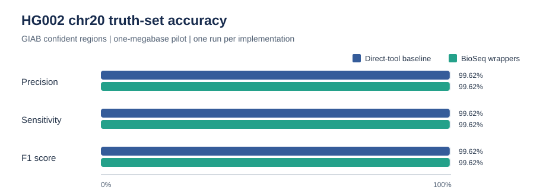
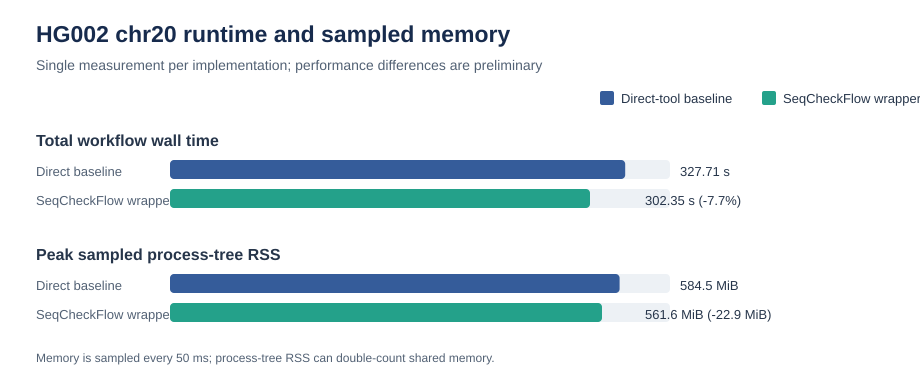

# Pipeline Analysis Report

## Scope

This report presents two separate analyses: a completed HG002 chromosome 20
pilot in `results/HG002_chr20_comparison/` and a completed raw-read RNA-seq
reanalysis of the public airway smooth-muscle study. The HG002 comparison uses
the same tools and arguments for a direct-tool baseline and BioSeq wrappers;
the interval is `chr20:10000000-11000000`, a one-megabase regional experiment,
not whole-genome validation. The RNA-seq findings come from eight raw-read
libraries processed through fastp, Salmon, tximport, and DESeq2, not from the
synthetic smoke-test data.

## Main findings

| Measure | Direct-tool baseline | BioSeq wrappers | Interpretation |
| --- | ---: | ---: | --- |
| Wall time | 327.71 s | 302.35 s | One measurement was 25.36 s (7.7%) faster with wrappers. |
| Peak sampled process-tree RSS | 584.5 MiB | 561.6 MiB | Wrapper run was 22.9 MiB lower in this measurement. |
| Output size | 603,418,500 bytes | 603,418,541 bytes | Effectively the same; the 41-byte delta is negligible. |
| True positives | 1,582 | 1,582 | Calls matched the same number of GIAB truth variants. |
| False positives | 6 | 6 | Same false-positive count. |
| False negatives | 6 | 6 | Same missed-truth count. |
| Precision | 0.9962 | 0.9962 | Same. |
| Sensitivity / recall | 0.9962 | 0.9962 | Same. |
| F1 | 0.9962 | 0.9962 | Same. |

## Interpretation and limitations

The identical truth-set scores are expected: both paths run the same aligner,
caller, tool versions, arguments, and data. This supports wrapper parity for
this pilot; it does not show that BioSeq improves variant accuracy.

The runtime and memory differences are descriptive, not established
performance gains. Each workflow ran once, so machine load, caching, and task
scheduling may explain the differences. RSS is sampled every 50 ms and may
miss short peaks; process-tree RSS sums per-process RSS and can double-count
shared memory.

This workflow does not fit a predictive model, so machine-learning overfitting
is not the right description of its risk. The relevant limitation is narrow
evaluation: one sample, one small region, and one truth set. The metrics should
not be generalized to whole genomes, other individuals, or clinical use.
Stronger evidence would repeat the measurement and evaluate additional
independent regions and samples.

## Reproducing the evidence

The summary values come from `results/HG002_chr20_comparison/comparison.json`
and the RTG `vcfeval` summaries in
`results/HG002_chr20_comparison/truth_evaluation/{baseline,candidate}/summary.txt`.
Those generated result files are local and are ignored by Git; the data and
methods are described in the README's HG002 pilot section.

## Raw-read RNA-seq differential-expression analysis

The airway RNA-seq workflow uses eight paired raw-read libraries from GEO
GSE52778 (four donor cell lines, untreated and dexamethasone treated). It runs
fastp and Salmon, imports transcript estimates with tximport, then tests the
treatment effect in DESeq2 using `~ cell + dex`. The results are a
dataset-specific reanalysis, not independent validation or a general clinical
claim.

### Sample structure (PCA)

The PCA shows the first two expression-variance axes, with treatment encoded by
color and donor cell line by point shape. It describes these eight samples; it
does not test treatment significance.

### Differential expression (MA plot)

### Differential expression (volcano plot)

### Read and quantification quality

The [MultiQC report](docs/reports/airway-multiqc.html) combines fastp read
quality metrics with Salmon library and quantification summaries across the
eight libraries.

### Result and interpretation

No genes passed the Benjamini-Hochberg adjusted `p < 0.05` threshold for the
dexamethasone effect after accounting for donor cell line (`~ cell + dex`).
This does not establish that dexamethasone has no biological effect: the
analysis has only four donor cell lines, limiting power to estimate treatment
effects across biological variability. This result is specific to this
reanalysis and is not independent validation.

The plots and MultiQC report are copied from the completed full raw-read
workflow. The synthetic-data R smoke test is only a software test and is not
used to generate the figures or support biological interpretation.
