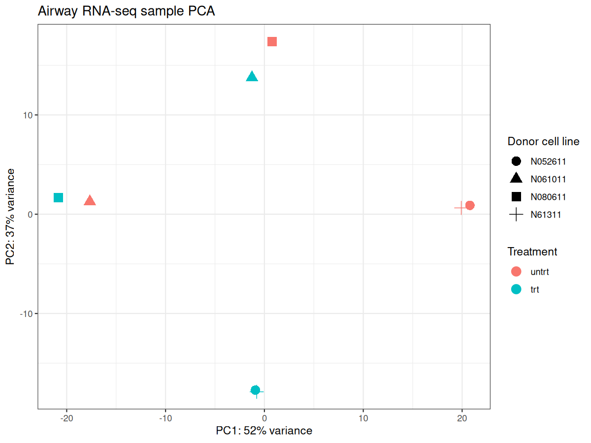
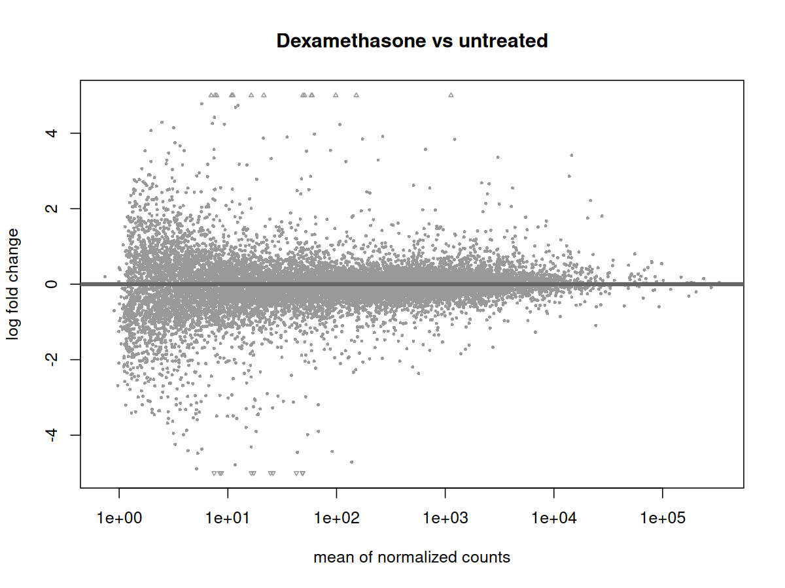
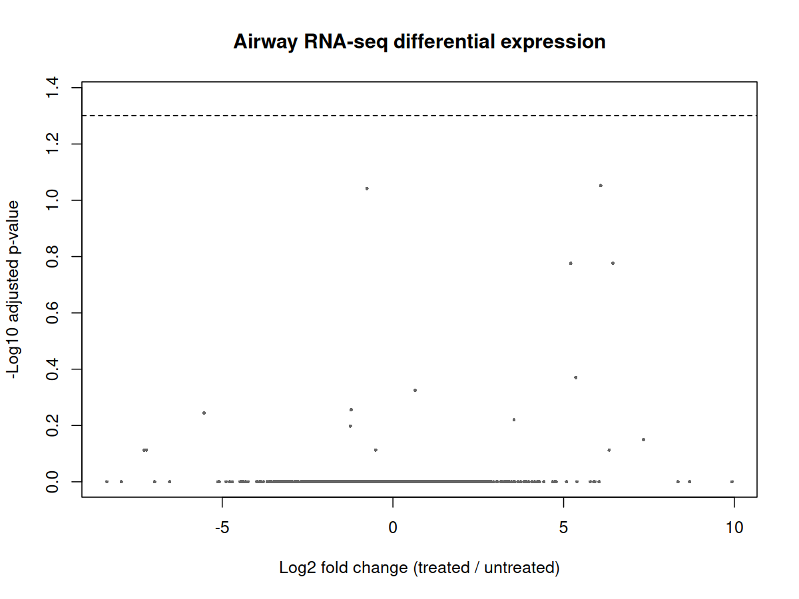

# BioSeq

[](https://github.com/Gculb/BioSeq_Project/actions/workflows/ci.yml)
[](https://github.com/Gculb/BioSeq_Project/actions/workflows/rnaseq.yml)
[](https://github.com/Gculb/BioSeq_Project/actions/workflows/hg002.yml)

**BioSeq is a small Python toolkit for getting common genomics files into a
usable, inspectable state.** It provides file validation and summary reports,
download and standalone tool helpers, plus separate Nextflow examples for
raw-read RNA-seq and regional variant calling.

The aim is to make routine file handling and entry-level analysis more
approachable—not to replace established bioinformatics tools, automatically
analyze every file type, or claim new biological findings.

## What it does today

| Entry point | Current scope |
| --- | --- |
| `bioseq.pipeline` | Processes one local FASTA, FASTQ, VCF/VCF.GZ, BAM, or CRAM file and writes JSON/text validation and summary reports. |
| `bioseq.download` | Searches/downloads NCBI sequence records and SRA FASTQ; downloads VCF/BAM/CRAM from direct URLs. |
| Standalone helpers | Optional alignment (BWA/minimap2), samtools operations, and remote NCBI BLAST. These are separate calls, not automatically chained by the single-file CLI. |
| `main.nf` | Eight-library airway RNA-seq example: ENA FASTQ → fastp → Salmon, then MultiQC QC and tximport/DESeq2 in R. |
| `hg002.nf` and benchmark commands | Staged, single-sample HG002 regional variant-calling example and wrapper-versus-direct-tool comparison. |

The CLI's reports are format-specific checks and measurements. It does **not**
trim FASTQ reads, align reads, call variants, annotate variants, or interpret
biological function. The RNA-seq and HG002 workflows are distinct examples
with their own inputs and outputs; they are not generic workflows automatically
selected for arbitrary files.

## How it is organized

The single-file path detects and validates an input, runs the applicable
summary logic, then writes JSON and text reports. Download and BLAST helpers
are opt-in utilities. The two Nextflow workflows provide explicit stages for
their specific analyses and use containers to package their external tools.
The RNA-seq workflow also calls an R/DESeq2 analysis; the HG002 workflow uses
the same underlying command-line tools in separately scheduled stages.

```text
Local file ──> bioseq.pipeline ──> validation + format-specific summary ──> JSON/text
NCBI/URL   ──> bioseq.download ──> downloaded file (analyze separately)
Raw RNA-seq ──> main.nf ──> fastp ──> Salmon ──┬─> MultiQC
                                               └─> tximport ──> R/DESeq2
HG002 region ──> hg002.nf / benchmark ──> calls ──> GIAB truth comparison
```

See [ARCHITECTURE.md](./ARCHITECTURE.md) for component responsibilities and
workflow diagrams, and [DESIGN_NOTES.md](./DESIGN_NOTES.md) for file formats,
metric interpretation, and implementation decisions.

## Example results and limits

The examples show what the current project has exercised; they do not establish
general performance, broad biological conclusions, or clinical validity.

| Example | Observed result | What it supports—and what it does not |
| --- | --- | --- |
| HG002 chr20 pilot | On a 1 Mb region, direct-tool and BioSeq-wrapper runs each had 1,582 true positives, 6 false positives, and 6 false negatives (precision/recall/F1 = 0.9962). | Supports wrapper parity for this run. The observed 328 s vs 302 s and 584.5 vs 561.6 MiB are single-run measurements, not proven performance gains. |
| Airway RNA-seq (GSE52778) | Eight raw-read libraries completed fastp and Salmon quantification; mapping rates were 92.3–93.9%. DESeq2 (`~ cell + dex`) found no genes below BH-adjusted `p < 0.05`. | Demonstrates a raw-read-to-analysis path. Four donors from one study are insufficient to interpret this as evidence of no treatment effect or to claim independent validation. |

The HG002 run is a regional, two-thread pilot—not whole-genome or cohort
validation. The RNA-seq example is an exploratory reanalysis of one public
study—not a new biological discovery. See
[HG002 chr20 results](./docs/images/hg002-accuracy-parity.svg),
[RNA-seq QC](./docs/reports/airway-multiqc.html), and the
[analysis report](./PIPELINE_ANALYSIS.md) for plots, methods, and caveats.

### RNA-seq plots

These figures come from the eight-sample raw-read analysis:







## Quick start: inspect a local file

Requires Python and the packages in [`requirements.txt`](./requirements.txt).
Some formats also need external tools such as samtools; BAM/CRAM summaries
require samtools installed on `PATH`.

```bash
pip install -r requirements.txt
python -m bioseq.pipeline data/examples/example.fasta
```

The command writes JSON and text reports to `results/` by default. Substitute
a local `.fastq`, `.vcf`, `.vcf.gz`, `.bam`, or `.cram` file to summarize another
supported format. CRAM may require a matching reference:

```bash
python -m bioseq.pipeline data/alignments/sample.cram \
  --reference data/references/reference.fasta
```

Downloading is a separate step. For example, SRA FASTQ download uses the NCBI
SRA Toolkit (`fasterq-dump`):

```bash
python -m bioseq.download fastq SRR123456 --threads 4
```

## Run the example workflows

Both are optional, resource-intensive examples and require Java 17, Nextflow
24.10.5, Docker, and a Linux environment (WSL2 is suitable on Windows). See
[the workflow and scaling notes](./ARCHITECTURE.md) before running larger data.

Raw-read RNA-seq:

```bash
docker build -f containers/rnaseq.Dockerfile -t bioseq-rnaseq:latest .
nextflow run main.nf -profile docker \
  --samplesheet analysis/airway_samples.tsv \
  --threads 2 \
  --outdir results/rnaseq_airway
```

The full run downloads multiple public FASTQ files and needs additional disk
space for reads, trimmed files, and the Salmon index. It produces a MultiQC
report and DESeq2 results and plots.

HG002 regional pilot (after building the benchmark image):

```bash
docker build -f containers/Dockerfile -t bioseq:latest .
nextflow run hg002.nf -profile docker \
  --interval chr20:10000000-11000000 \
  --threads 2 \
  --outdir results/HG002_nextflow
```

For the wrapper-versus-direct baseline and truth-set comparison, follow the
commands in the [HG002 architecture and results documentation](./ARCHITECTURE.md)
and [analysis report](./PIPELINE_ANALYSIS.md).

## Reproducibility and execution status

GitHub Actions runs the Python CLI tests and checks the RNA-seq image, R
smoke-test, and Nextflow preview on pushes and pull requests. The complete
raw-read RNA-seq and HG002 runs are manual because they download large public
datasets and consume more compute. A passing preview or synthetic R smoke-test
does not mean that a full hosted analysis ran; full-run outputs are produced
only when the corresponding workflow is explicitly dispatched.

The included results are small demonstrations: the HG002 pilot uses one
region, while the RNA-seq analysis uses eight libraries from four donors.
Whole-genome or multi-sample scaling would require larger compute and storage,
interval scatter/gather, and cohort-aware calling steps that are outside the
current pilot scope.
